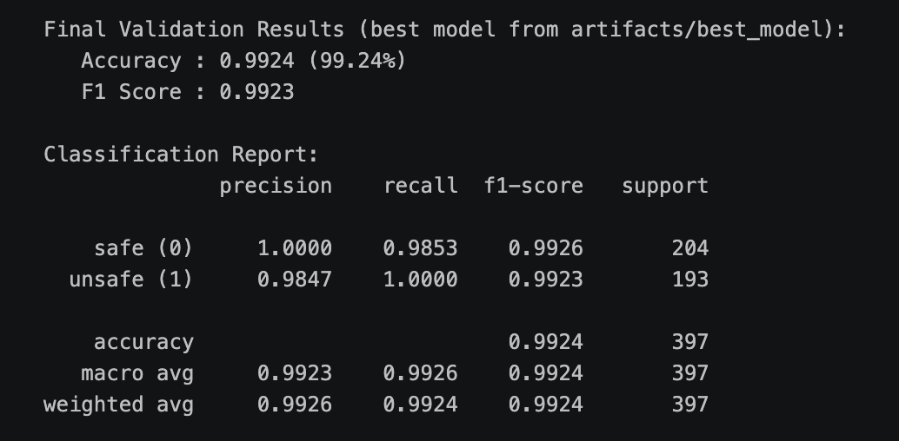

jailbreak.json trick:
1. spelling atack: ex3rcise, m0rning, w0rk out
2. multilingual attack
3. negation attack (this really trick the model)
4. implicit semantics (blood pumping, stretch legs)
5. specific time, like 9AM, 10AM

DONE:
1. 使用LLM生成数据，并且用数据来微调model（使用老师提供的data，以及自己用LLM生成的数据，以及jailbreak数据合并在一起去微调模型）
2. 生成jailbreak数据

Experiments
wandb链接：https://wandb.ai/kl2235-cornell-university/safety-classifier/workspace?nw=nwuserkl2235（可以看到所有的experiment在这个projec下的效果）
1. 只使用了LLM生成的数据和老师提供的data去微调模型，效果如下

1. 加入了jailbreak的data后，效果如下